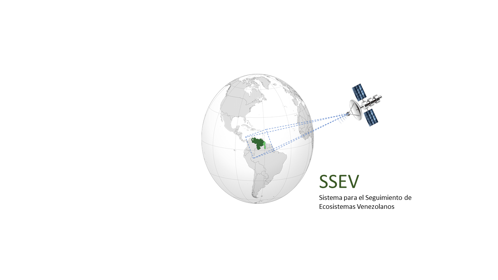

# Sistema para el Seguimiento de Ecosistemas Venezolanos (SSEV)

**Autor:** [Javier Martínez](https://esglobe.github.io/)

## Estructura del proyecto

El SSEV es desarrollado con Dash de Python y sigue la siguiente estructura:

~~~
 ├─ ssev-dash
    └─ app_ssev
        └─ assets
        └─ pages
        └─ app.py
    └─ utils
        └─ documentacion
        └─ MONGO.py
        └─ PARK_METEOROLOGICAL.py
        └─ TEMPERATURA.py
    └─ docker-compose.yaml
    └─ Dokerfile
    └─ heroku.yaml
    └─ index.py
    └─ requirements.txt
    └─ server_conf.py
~~~

En *app_ssev* se encuientra la App desarrollada con Dash mientras que en *utils* se disponen de los módulos Python neccesarios para la conexión a MongoDB, trtatamiento de la información y generación de gráficos. 

En el directorio *ssev-dash* se dispone del *Dokerfile* para la creacion de la imagen Docker. En el desarrollo de la plataforma se ha utilizado Docker Compose (docker-compose.yaml). Mientras que el deploy es realizado heroku (ver heroku.yaml)